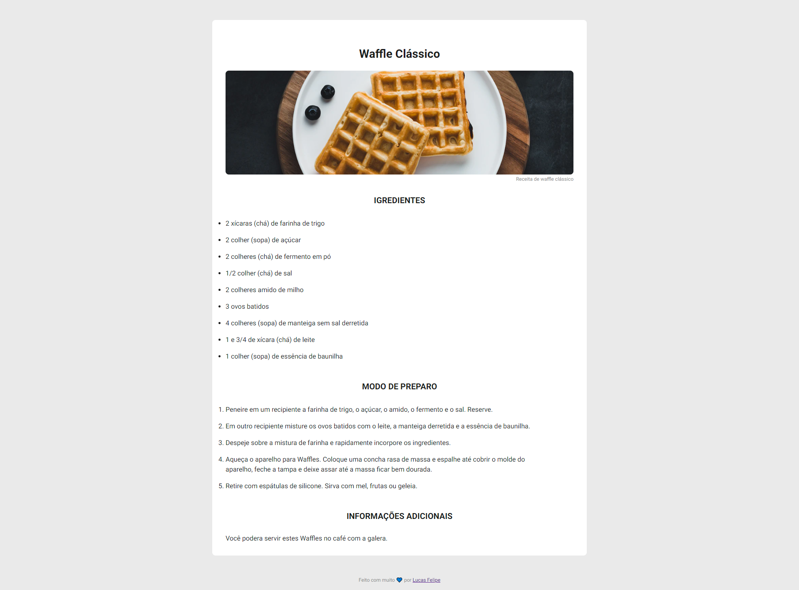

# Challenge

Desafio proposto pela [Rocketseat](https://www.rocketseat.com.br/) da trilha Discovery, o desafio se consiste em criar uma página web de uma receita, contendo titulo, imagem, lista de ingrediente e modo de preparo.  

Caso queira ver mais desafios, basta acessar meu perfil no [Github](https://github.com/LFeli) e utilizar o termo "Challenge". Ou basta clicar em [ver mais desafios](https://github.com/LFeli?tab=repositories&q=Challeng&type=&language=&sort=).

## Sumário 
- [Dúvidas](#dúvidas)
- [Tecnologias](#tecnologias)
- [Resultado final](#resultado-final)

## Dúvidas
#### Como posso visualizar o projeto final?
Simples basta clicar aqui em [Visualizar projeto final](https://lfeli.github.io/Challenge-Rocketseat-pagina-de-receita/) que você já será redirecionado.  

#### Como posso fazer o desafio?
Basta ir no site da [Rocketseat](https://www.rocketseat.com.br/) e se inscrever na **Discovery**.

## Tecnologias
- HTML 5
- CSS 3

## Resultado final
Abaixo uma captura do arquivo final pronto. Ou veja pessoalmente clicando [aqui](https://lfeli.github.io/Challenge-Rocketseat-pagina-de-receita/).

